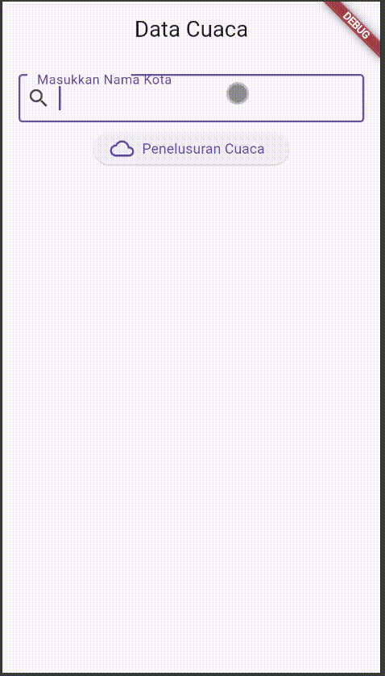

# tugasdataapi

Kode yang berada difile weather_service.dart penjelasannya sebagai berikut:
    WeatherService class yaitu Kelas yang bertanggung jawab untuk mengambil data cuaca dari OpenWeather API berdasarkan nama kota yang diberikan,
    apiKey yaitu variabel yang menyimpan kunci API yang digunakan untuk mengakses layanan cuaca tersebut,
    Method fechWeather berfungsi menerima parameter city dan membangun URL untuk mengakses API cuaca.

Kode yang berada difile home_screen.dart penjelasannya sebagai berikut:
    WeatherScreen Class yaitu widget stateful yang menangani tampilan dan logika interaksi cuaca,
    _WeatherScreenState Class Merupakan bagian dari WeatherScreen yang menangani perubahan state (data cuaca) berdasarkan input dari pengguna,
    WeatherService weatherService Sebuah instance dari kelas WeatherService yang menangani permintaan API, TextEditingController cityController digunakan Untuk mengambil input kota dari pengguna, Map<String, dynamic>? weatherData digunakan untuk Menyimpan data cuaca yang diterima dari API.
    Method fetchWeather fungsi ini dipanggil saat pengguna menekan tombol untuk mencari cuaca.

# Ini Dokumentasinya

A new Flutter project.

## Getting Started

This project is a starting point for a Flutter application.

A few resources to get you started if this is your first Flutter project:

- [Lab: Write your first Flutter app](https://docs.flutter.dev/get-started/codelab)
- [Cookbook: Useful Flutter samples](https://docs.flutter.dev/cookbook)

For help getting started with Flutter development, view the
[online documentation](https://docs.flutter.dev/), which offers tutorials,
samples, guidance on mobile development, and a full API reference.
